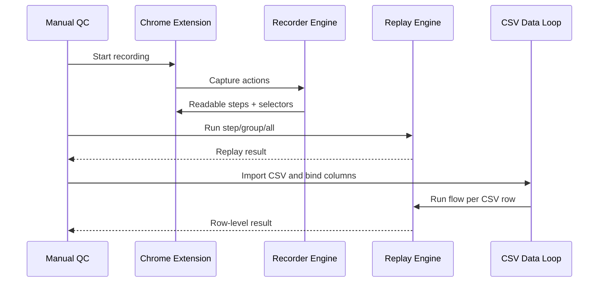
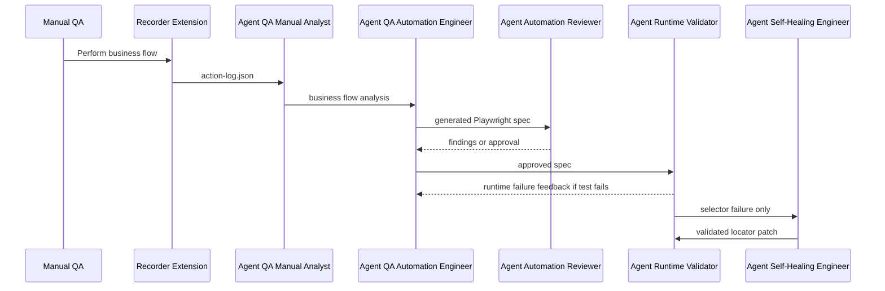

# Agent Interaction Contract

## Current Lane A Contract

## Future Lane B Contract

## Flow

## Data Contracts

### Recorder To Manual Analyst

- `logs/action-log.json`

### Manual Analyst To Automation Engineer

- business step list
- expected result per step
- suspicious action list
- repeatable group intent
- loop count guidance

### Automation Engineer To Reviewer

- generated Playwright spec
- generation notes

### Reviewer To Automation Engineer

- approved flag
- structured findings

### Runtime Validator To Automation Engineer

- command
- exit code
- stdout/stderr summary
- failed file and line when available

### Runtime Validator To Self-Healing Engineer

- failure type
- old selector
- failed code line
- DOM snapshot
- accessibility snapshot
- original action context

### Self-Healing Engineer To Runtime Validator

- old selector
- new selector
- validation result
- patch diff
- healing event log entry
