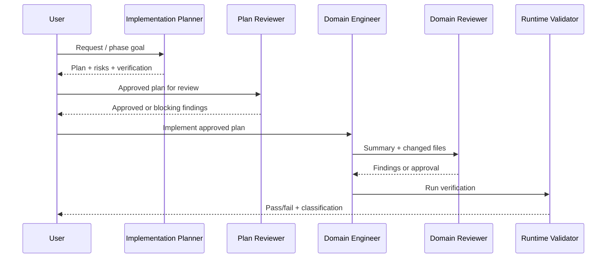

# Workflow: Plan -> Review Plan -> Implement -> Test

## Purpose

Keep implementation work aligned with `RULE.md` and prevent unreviewed architecture changes.

## Flow

## Domain Engineer Selection

- Recorder changes: `recorder-engineer.md`
- CSV/data changes: `data-loop-engineer.md`
- Playwright generation: `qa-automation-engineer.md`
- Lane C security: `security-implementation-engineer.md`
- Selector healing: `self-healing-engineer.md`

## Reviewer Selection

- Playwright generated code: `automation-reviewer.md`
- Lane C security rules/findings: `security-reviewer.md`
- Plan review: `plan-reviewer.md`

## Required Gates

1. No implementation without a plan.
2. No implementation when plan review has blocking findings.
3. No final handoff without focused verification or a clear reason verification could not run.
4. No broad refactor unless explicitly approved in the plan.
