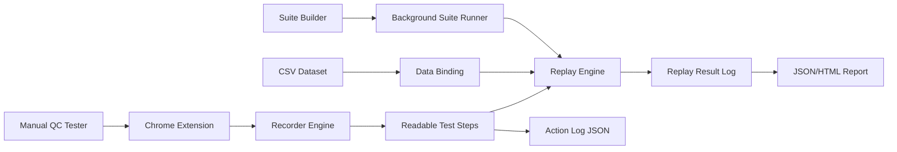
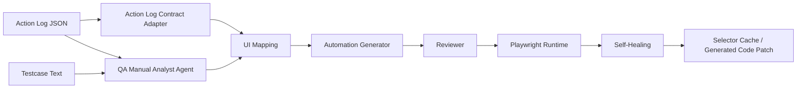

# Architecture Context

## Current Architecture: Lane A Manual QC Assistant

## Future Architecture: Lane B AI Automation Factory

Lane B is future scope. It should reuse Lane A data and selector assets through the exported action log contract.

Important boundary:

- Lane B should consume exported action logs, not Chrome extension popup state.
- Suite Builder state is UI state. For Lane B, use exported action logs or merged suite action logs.
- Self-healing should patch generated Playwright code or a selector cache; it should not silently mutate the original user intent in the source action log.

## Lane A Components

### Chrome Extension

Primary user-facing tool.

Responsibilities:

- Start/stop recording.
- Capture browser actions.
- Display readable steps.
- Replay step/group/all.
- Export action log.
- Import CSV and run data loops.
- Import multiple flows and run a suite.
- Export run reports.

### Recorder Engine

Captures:

- click
- input/change
- text, textarea, select, radio, checkbox metadata
- URL/screen context
- visible text
- target metadata
- selector candidates

### Selector Engine

Extracts fallback selectors:

- `data-testid`
- `id`
- role + accessible name
- css
- relative xpath

### Action Normalizer

Converts raw browser events into stable action log data:

- deduped actions
- readable descriptions
- groups
- screen names
- repeat metadata

### Action Log Contract

Portable JSON artifact exported by Lane A and consumed by Lane B.

Responsibilities:

- preserve manual tester intent
- preserve selector candidates
- preserve groups/screens for `test.step(...)`
- preserve control metadata for Playwright API selection
- preserve dataset/binding information for data-driven tests

It is the main input for future Playwright generation and self-healing workflows.

### Playwright Generator

Future Lane B generator output must use:

- JavaScript.
- Page Object Model.
- `test.step(...)` in the spec for readable execution narrative.

### Replay Engine

Runs actions in the active/demo browser tab for single replay workflows:

- replay step
- replay group
- replay all
- respect fixed repeat count
- highlight element
- scroll to element
- type input values
- set select/radio/checkbox values
- show replay narration

Replay is not Playwright validation. It is quick validation for manual QC. Multi-flow Suite execution is delegated to the background runner.

### Background Suite Runner

Runs multi-flow suites outside the popup lifecycle.

Responsibilities:

- open or focus a local demo runner tab
- keep one runner tab for the full suite
- navigate to each flow start URL
- execute flow actions through the replay engine
- store flow-level results in `chrome.storage.local`
- capture a visible-tab screenshot on failure when available

### Local Demo Server

Responsibilities:

- Serve the demo shop.
- Receive saved action logs from the extension.
- Serve direct route URLs such as `/products` and `/checkout`.

### CSV/Data Loop Engine

Responsibilities:

- import CSV
- preview rows
- bind CSV columns to input steps
- run one flow per row
- report row-level pass/fail

### Manual QC Report

Responsibilities:

- show replay history
- show CSV row result
- show suite flow result
- export result JSON/HTML
- include failure screenshot when available

## Existing Helper Components

Playwright scripted recorder remains useful only as a fixture/helper for deterministic development checks.

It must not be presented as the main recorder.
